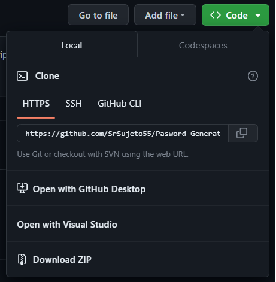
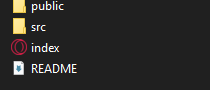

# Pasword-Generator
A Super Basic Generator of paswords

This project is a basic **solo project** form a online HTML curse in Scrimba

https://scrimba.com/learn/frontend

# Display the page

in order to watch this project online you must clone the repo by clicking the "code" button

then, in a route of your preference, you type

    git clone https://github.com/SrSujeto55/Pasword-Generator.git

    Cloning into 'Pasword-Generator'...
    remote: Enumerating objects: 98, done.
    remote: Counting objects: 100% (98/98), done.
    remote: Compressing objects: 100% (56/56), done.
    remote: Total 98 (delta 22), reused 93 (delta 22), pack-reused 0
    Receiving objects: 100% (98/98), 62.05 KiB | 934.00 KiB/s, done.
    Resolving deltas: 100% (22/22), done.

head to this new folder and click in the index icon, witch should appear like your default browser logo

Alternatively, you can just visit the webpage as long as it has support by netlify:

https://quiet-crepe-4f1be9.netlify.app